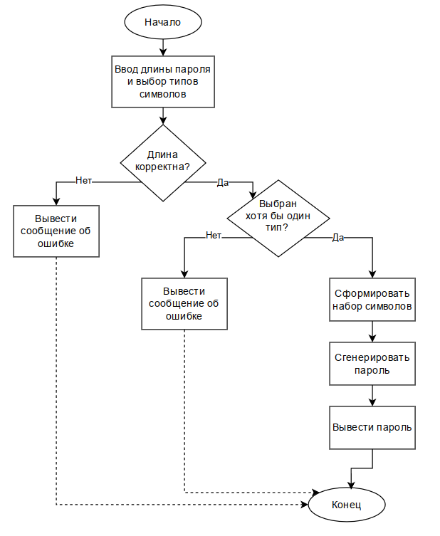

## Генератор паролей \ Password generator
Генератор паролей создается в учебных целях 

### Идея проекта
Разработать простое приложение с графическим интерфейсом для генерации 
случайных паролей по заданным пользователем параметрам.

### Базовый функционал (MVP)
Для реализации основной идеи приложения необходимо выполнить следующие функции:
1) Возможность указать длину создаваемого пароля.
2) Возможность выбрать используемые типы символов: цифры, буквы и специальные символы.
3) Генерация случайного пароля в соответствии с выбранными параметрами.
4) Отображение созданного пароля в окне приложения.

### Дополнительный функционал
В перспективе развития проекта планируется реализовать
следующие функции:
1) Возможность отдельного или совместного использования строчных и прописных букв.
2) Кнопка копирования пароля в буфер обмена.
3) Проверку надежности пароля.
4) Локальное хранилище паролей.

### Структура проекта
Проект разделен на несколько файлов, каждый из которых выполняет свою задачу:
1) main.py — отвечает за графический интерфейс приложения, получение параметров от пользователя, проверку введенных данных и вывод сгенерированного пароля.
2) gen_pass.py — отвечает за формирование набора допустимых символов и генерацию случайного пароля заданной длины.
3) README.md — содержит описание проекта, его цели, функциональные возможности, структуру и инструкцию по запуску.
4) scheme.png — рисунок схемы для readme файла.

password_generator\
│ ├── main.py \
├── gen_pass.py\
├── check_pass.py\
└── README.md

### Алгоритм работы
Основной алгоритм работы приложения генерации пароля:
1) Пользователь запускает приложение.
2) Пользователь указывает длину пароля.
3) Пользователь выбирает типы символов, которые необходимо использовать.
4) Программа проверяет корректность введенной длины пароля.
5) Программа проверяет, выбран ли хотя бы один тип символов.
6) На основе выбранных параметров формируется набор допустимых символов.
7) Из сформированного набора случайным образом выбираются символы в количестве, соответствующем заданной длине пароля.
8) Полученный пароль отображается в окне приложения.

### Алгоритм проверки пароля
Для определения надежности пароля выполняется анализ его длины и используемых типов символов.

Проверка выполняется по следующим критериям:
Длина пароля составляет не менее 8 символов.
Длина пароля составляет не менее 12 символов.
В пароле присутствуют строчные буквы.
В пароле присутствуют прописные буквы.
В пароле присутствуют цифры.
В пароле присутствуют специальные символы.

За выполнение каждого условия начисляется один балл, если длина пароля более 12 символов то два балла.
По сумме полученных баллов определяется уровень надежности:
1) 0–2 балла — слабый пароль;
2) 3–4 балла — пароль средней надежности;
3) 5–6 баллов — надежный пароль.

### Блок-схема

### Контроль версий
Для проекта используется система контроля версий Git. 
Создан локальный Git-репозиторий, связанный с удаленным репозиторием. 
Изменения в проекте фиксируются с помощью коммитов с кратким описанием выполненных изменений.

### Установка и запуск

Приложение предназначено для генерации случайных паролей по заданным пользователем параметрам. Пользователь может указать длину пароля и выбрать типы используемых символов: цифры, буквы и специальные символы.
Для запуска приложения необходимо:
1) Установить Python 3.
2) Скачать или клонировать файлы проекта.
3) Перейти в каталог проекта.
4) Запустить файл main.py командой:
	python main.py

После запуска откроется графическое окно приложения.
Для генерации пароля необходимо указать его длину, выбрать необходимые типы символов и нажать кнопку «Генерировать». Полученный пароль будет отображен в соответствующем поле.
### Результат работы